# AIMX user guide

AIMX (AI Mail Exchange) is a self-hosted SMTP server that gives AI agents their own addresses on a domain you control. Mail is parsed into Markdown with TOML frontmatter and written to disk. Agents read and send through the built-in MCP server, the `aimx` CLI, or the filesystem directly. `aimx serve` is the daemon; every other subcommand is short-lived.

## How it works

<a href="diagrams/architecture.svg" target="_blank" rel="noopener" title="Open diagram in a new tab">
  
</a>

- **Single binary.** Written in Rust. No runtime dependencies.
- **`aimx serve` is the daemon.** Embedded SMTP listener for inbound mail. Every other command is short-lived.
- **No IMAP / POP3.** Agents read `.md` files via MCP or the filesystem.
- **Markdown-first.** Mail is stored as Markdown with TOML frontmatter, LLM- and RAG-friendly without a parser.

## Quick start

```bash
# 1. Install (Linux only; x86_64 and aarch64, glibc and musl)
curl -fsSL https://aimx.email/install.sh | sh

# 2. Run setup (generates service file, DKIM keys, DNS guidance)
sudo aimx setup agent.yourdomain.com

# 3. Verify
sudo aimx portcheck
```

See [Installation](installation.md) for install flags, verification, and upgrades,
and [Getting Started](getting-started.md) for the full walkthrough.

## Guide contents

| Page | What it covers |
|------|----------------|
| [Getting Started](getting-started.md) | Requirements, installation, first setup |
| [Installation](installation.md) | One-line installer, flags, verification, `aimx upgrade`, rollback |
| [Setup](setup.md) | DNS, verification, DKIM key management, production hardening |
| [Configuration](configuration.md) | `config.toml` field reference, data / config directories, environment variables |
| [Security](security.md) | Threat model, trust boundaries, what AIMX defends and what it does not |
| [Mailboxes & Email](mailboxes.md) | Mailbox CRUD, email frontmatter, attachments, sending, threading |
| [Markdown Email](markdown-email.md) | How outbound `--body` is rendered to HTML, the inlined stylesheet, escape hatches |
| [Hooks & Trust](hooks.md) | `on_receive` / `after_send` events, ownership-as-authorization, trust gate |
| [Hook Recipes](hook-recipes.md) | Copy-paste hook snippets per agent (Claude Code, Codex, OpenCode, Gemini, Goose, OpenClaw, Hermes, NanoClaw) |
| [MCP Server](mcp.md) | The 12 MCP tools: parameters, frontmatter contract, workflow examples |
| [Agent Integration](agent-integration.md) | `aimx agents setup` installer, per-agent configuration, manual MCP wiring |
| [CLI Reference](cli.md) | Every `aimx` subcommand and flag |
| [Troubleshooting](troubleshooting.md) | Diagnostics, common issues, useful commands |
| [FAQ](faq.md) | Deployment, DNS, storage, MCP, and operations questions |
